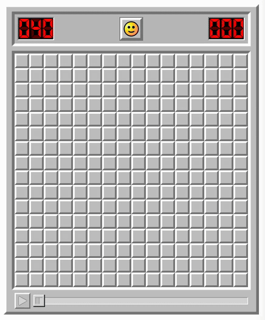

# Automated Minesweeper solver

An automated minesweeper solver.  Below is an image illustrating it in
action.  The first game is solved but the second blows up.



## Requirements

1. Python 3.9+
2. Java 17+

## Setup

The project consists of 2 parts: A Java HTTP Server and a Python program.

The Java server acts as a robot, moving the mouse, clicking the mouse,
and taking screenshots.

The Python program has dependencies.  The simplest way to setup is to
use venv as follows:

```bash
python -m venv .venv
. .venv/bin/activate
pip install -r requirements.txt
```

Open the minesweeper game and keep it ready.

## Running

### Java server

First start the Java server as follows

```bash
java MinesweeperPlayer.java 8888 100
```

This runs the server on port 8888 with a 100ms delay between actions.

### Python

You will have to keep your minesweeper board open.  The program uses
OpenCV to identify the minesweeper board and for that it needs the
program up and running.  So open up your browser, and head over to
https://minesweeper.online/.  Select any of **Beginner**,
**Intermediate**, **Expert**, or **Custom**.  (I recommend starting
small and choosing **Beginner**.)

Once you have the game open on one side, open up your terminal and run

```bash
python play.py 8888
```

If all goes well, you will see the program running and trying to solve
the game.

Feel free to raise an issue or email me if you run into any problems.
